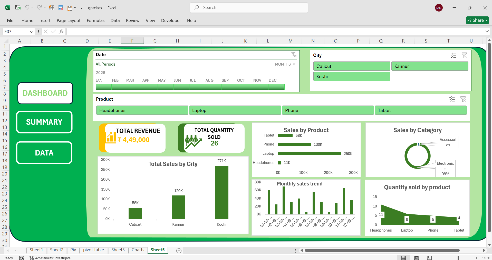

# Excel Sales Dashboard

## Project Overview

An interactive sales dashboard built using Microsoft Excel
to analyze sales performance across products, cities,
categories, and time periods.

## Dashboard Features

- Total Revenue KPI
- Total Quantity Sold KPI
- Sales by Product
- Sales by Category
- Sales by City
- Monthly Sales Trend
- Product Quantity Analysis
- Interactive Date, City and Product Filters

## Tools Used

- Microsoft Excel
- PivotTables
- PivotCharts
- Slicers
- Excel Formulas
- Data Cleaning
- Data Visualization

## Dashboard Preview

